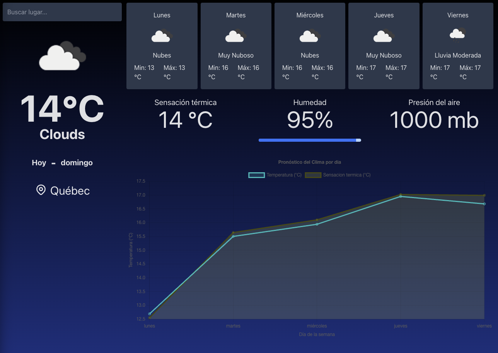
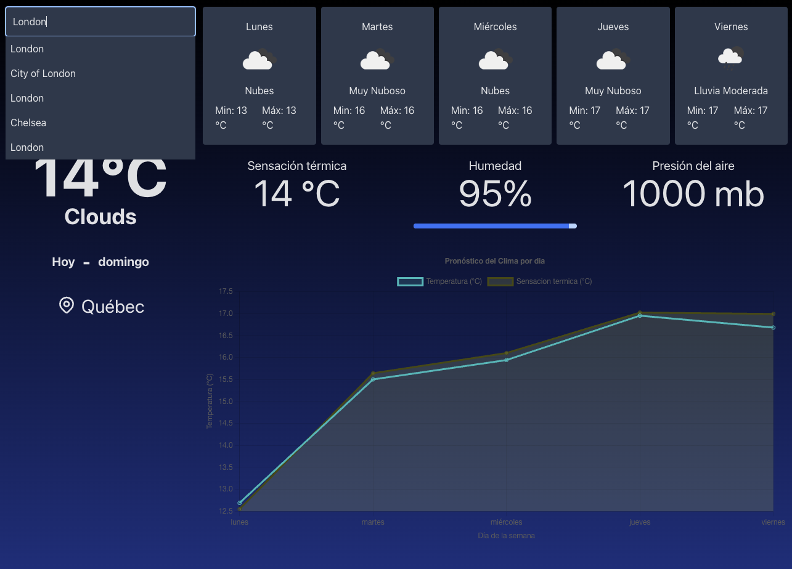
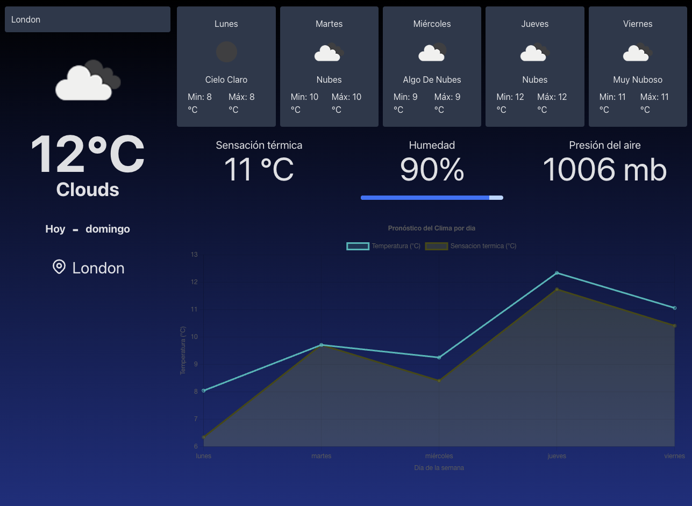

# Demo

https://ricardoevz.github.io/weather/

# Pasos para Configurar y Ejecutar la Aplicación

1. **Clonar el proyecto:** Descarga el repositorio en tu máquina local.

2. **Posicionarse en el proyecto e instalar las dependencias:** Navega hasta el directorio del proyecto e instala las dependencias necesarias.

3. **Configurar la API Key:** Abre el archivo /src/apis/api.ts y reemplaza el valor de [appid] con una clave API válida.

```
config.params['appid'] = 'YOUR_API_KEY';
```

4. **Iniciar la aplicación:** Ejecuta el siguiente comando para iniciar la aplicación en modo de desarrollo:

```
npm run dev
```

5. Ejecutar las pruebas unitarias: Utiliza el siguiente comando para ejecutar las pruebas unitarias:

```
npm run test
```

# Weather App

**Weather App** es una aplicación sencilla que proporciona información meteorológica actual y la previsión para los próximos 5 días. Además, ofrece datos adicionales como la **sensación térmica**, la **humedad** y la **presión atmosférica**. En la parte inferior de la interfaz, se incluye un gráfico de líneas que compara la temperatura y la sensación térmica a lo largo de la semana.

## Características Principales:

- **Ubicación del Usuario**: La aplicación intenta obtener la ubicación actual del usuario para mostrar datos meteorológicos específicos de esa área. Si el usuario no concede permisos de ubicación, la aplicación usa por defecto la ubicación de Quebec.
- **Búsqueda de Ciudades**: El usuario puede buscar manualmente la ciudad de la que desea conocer el clima.
- **Gráfico Comparativo**: Una gráfica de líneas al final de la página que visualiza la temperatura y la sensación térmica semanalmente.

## Decisiones de Diseño:

Para la gestión del estado, se ha utilizado **Context API**, ya que se considera suficiente para esta aplicación. No se ha visto necesario emplear librerías externas como Redux Toolkit o Zustand.

## Tecnologías Utilizadas:

- **React** con **TypeScript**: Para la construcción de la interfaz y la lógica de la aplicación.
- **Tailwind CSS** y **Material-UI**: Para el diseño y estilización.
- **Chart.js**: Para la visualización de datos mediante gráficos.

## Capturas de Pantalla

1. **Vista Principal**
   

2. **Pantalla de Búsqueda**
   

3. **Resultados de la Búsqueda**
   
